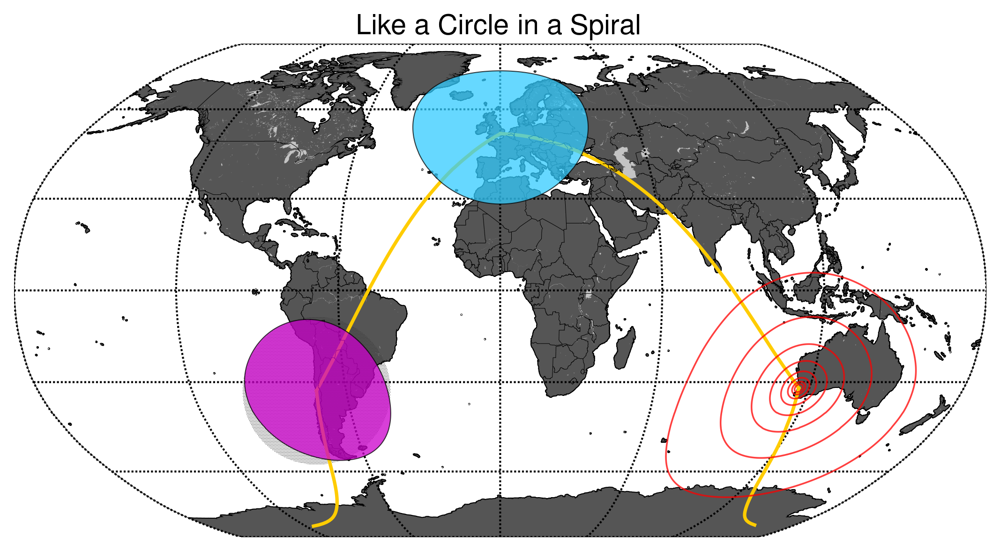

# Basic Geo and Spatial Analysis Techniques Using Python #

This is a repository of various geo/spatial analysis techniques using Python libraries, chiefly Numpy, Pandas, Shapely, Fiona, Descartes, Matplotlib, and Matplotlib-Basemap.

## The Notebooks

[Convert](http://nbviewer.ipython.org/github/urschrei/Geopython/blob/master/convert.ipynb): demonstrates point, choropleth, and hexbin mapping techniques using pandas and Matplotlib Basemap  

[Convert_Folium](http://nbviewer.ipython.org/github/urschrei/Geopython/blob/master/convert_folium.ipynb): demonstrates the use of the [Folium](https://github.com/wrobstory/folium) library for creating web-based maps from Python data (pandas) using [Leaflet](http://leafletjs.com) to generate a choropleth map

[Contour](http://nbviewer.ipython.org/github/urschrei/Geopython/blob/master/contour.ipynb): demonstrates interpolation of irregularly-spaced point data (mean rainfall) into a regular grid, calculating a contour plot, and imposing it onto a basemap (see graphic above). I then compare two approaches for generating surfaces – Delaunay Natural Neighbour (`matplotlib.griddata`), and refinement of a coarse Delaunay mesh using `matplotlib.UniformTriRefiner`, which uses recursive subdivision and cubic interpolation. High-res images are available in the [data](data) folder, all beginning with `rainfall_`. :umbrella::umbrella::umbrella:  
Finally, the map is partitioned into *clipped* Voronoi cells based on the sensor locations, and some plotting methods (more flexible than `scipy.spatial.voronoi2d`) are shown.  

[Bikepath](http://nbviewer.ipython.org/github/urschrei/Geopython/blob/master/bikepath.ipynb): we take a list of London bicycle hire stations, create a DataFrame of all possible origin and destination pairs, and then use MapZen's wonderful [open OSRM endpoint](https://mapzen.com/blog/osrm-services) to get valid bicycle routes between them. Then we plot those routes (it's just the first 100 – there are over 490k origin / destination pairs in total) on a map.

[Isochrone](http://nbviewer.ipython.org/github/urschrei/Geopython/blob/master/isochrone.ipynb): computing an isochrone for our sample bike network from an origin at Abbey Orchard Street. The cost function is calculated from Dijkstra's Shortest Path Length, weighted by the travel time between the origin and destinations.

[Plaques_Geopandas](http://nbviewer.ipython.org/github/urschrei/Geopython/blob/master/plaques_geopandas.ipynb): demonstrates [Geopandas](http://geopandas.org) and its spatial join functionality, used to create a choropleth.

[Circles](http://nbviewer.ipython.org/github/urschrei/Geopython/blob/master/circles.ipynb): demonstrates drawing circles with correct distortion characteristics on a map (the dot-shaded circle is erroneously non-distorted). The helper library used to plot the circles is available [here](https://github.com/urschrei/Circles).

---
## Installation and usage

Note that for most users, the Enthought [Canopy](https://www.enthought.com/products/canopy/) Python distribution is probably the best way to get the required libraries (You'll have to install Folium and GeoPandas separately – they aren't included). However, feel free to install the libraries manually using `requirements.txt` if you know what you're doing, in which case you'll also need various compilers (GCC, Fortran), and libraries (GDAL, GEOS). The use of a [virtualenv](http://virtualenv.readthedocs.org/en/latest/) is advised.

# License  
© Stephan Hügel 2014  

Unless otherwise specified, the [wards.geojson](wards.geojson) file and any UK shapefiles are provided under
[Crown Copyright](http://www.nationalarchives.gov.uk/information-management/re-using-public-sector-information/copyright/crown-copyright/), and their use must be acknowledged in any output by reproducing the following notice:

`Contains Ordnance Survey data  
© Crown copyright and database right 2014`

Unless otherwise specified, all other files are provided under the [Creative Commons Attribution-NonCommercial-ShareAlike 4.0 International](http://creativecommons.org/licenses/by-nc-sa/4.0/) license.  

